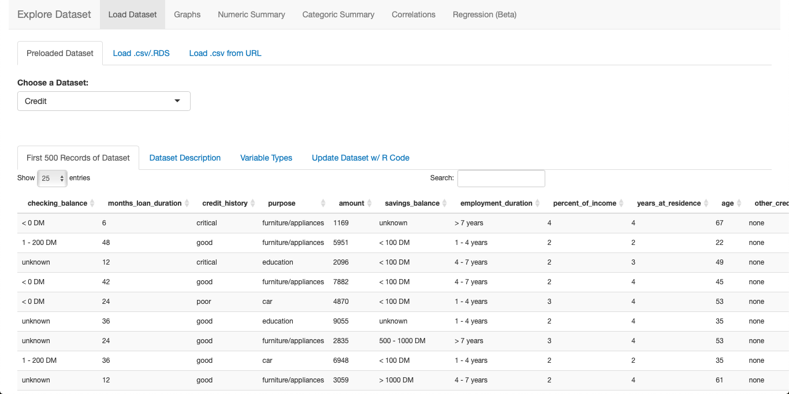
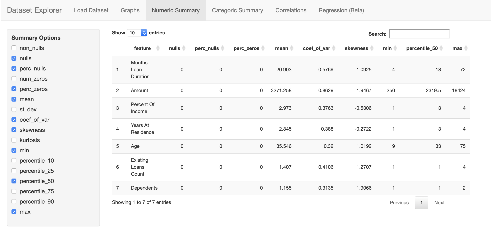
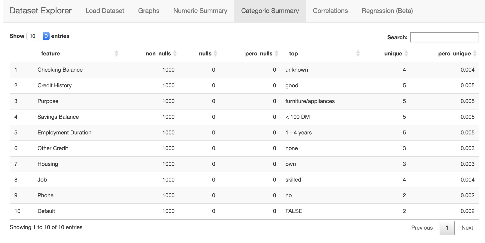
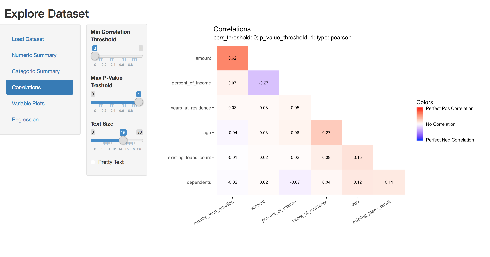
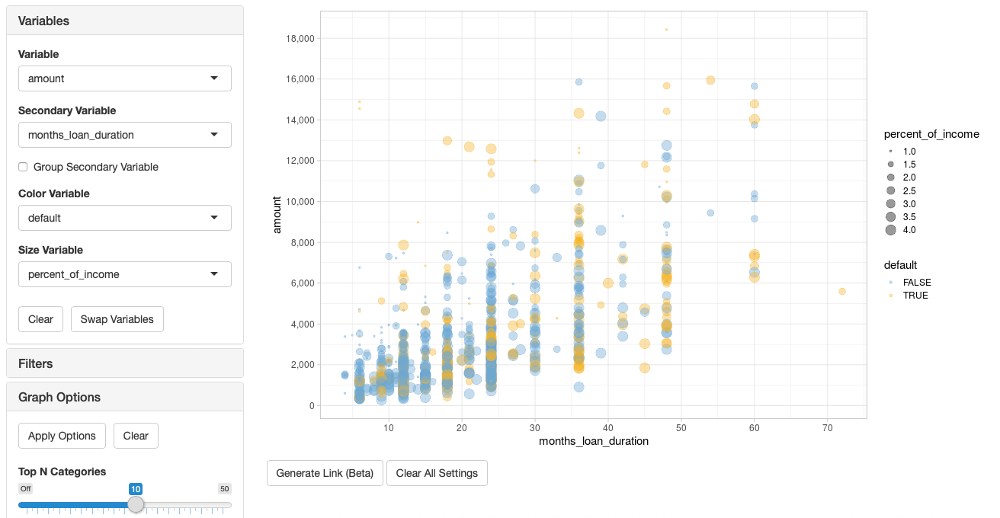
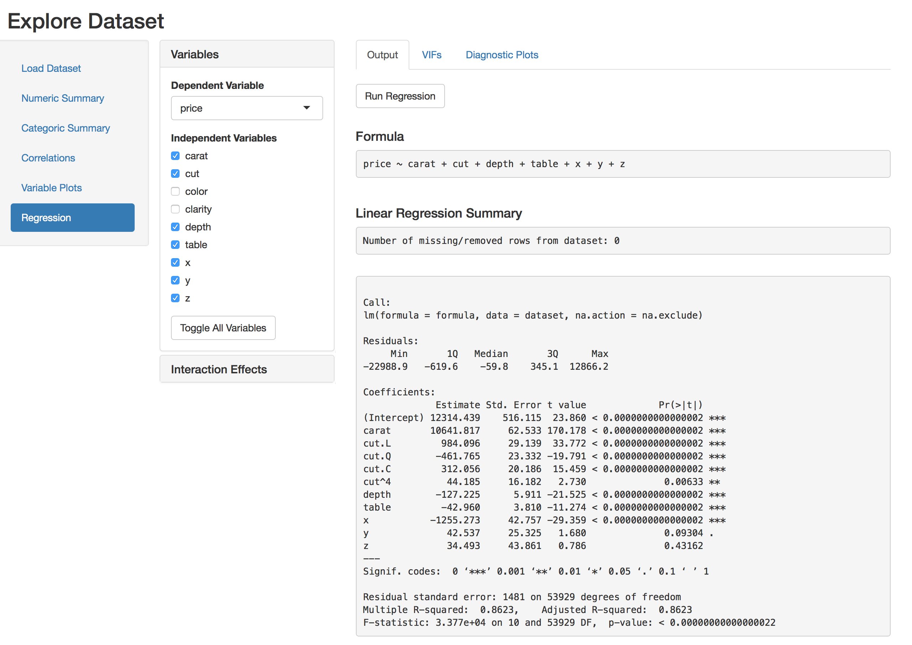

# shiny-explore-dataset

Shiny Application for exploring new datasets.

## Hosted on shinyapps.io

The app is currently hosted at https://kercheval.shinyapps.io/shiny-explore-dataset/.

`shinyapps.io` gives a limited number of uptime hours per month at the free level, so it might be sporatically unavailable.

## Run Locally

This app utilitizes my [`rtools`](https://github.com/shane-kercheval/rtools) package which is a personal library of code that I typically re-use.

So, if you want to run locally, among the other libraries that are imported, you'll have to install `rtools` from github

```r
devtools::install_github('shane-kercheval/rtools')
```

## Notes On How to Use

### General Comments

- The intent of this app is A) a personal learning project, not necessarily meant to be consumed by others or be continually updated/maintained B) as a very basic (surface-level) tool for Exploratory Data Analysis. The goal is to quickly become familiar with the dataset, and to streamline the most common data-slicing techniques you will initially do when exploring datasets for the first time. Most EDAs will require much more in-depth techniques than this tool can provide, but it should get you to that point faster.
- This app:
    - expects tidy datasets (http://vita.had.co.nz/papers/tidy-data.pdf)
    - doesn't always play nice with `tibbles`

### Loading datasets



- Loads either preloaded datasets, or either a .csv or .RDS
    - The downside of loading a CSV is that the app won't be able to use ordered factors, or anything that isn't automatically detected by `read.csv()`.
- `Add Date Fields based on Date Variable` adds various date fields to the dataset (e.g. year/month/week/day/is_weekend/etc.)

### Numeric Summary



### Categoric Summary



### Correlations



### Variable Plots



- Filtering Notes
    - when the filter is enabled, the header will turn green
    - when the filter is enabled and changes have been made but not applied, the header will turn red
    - sliders for filtering numeric data are inclusive 
- WARNING: enabling the filters removes all of the NA/missing values from each of the numberic variables even if the sliders are still set to the min/max values. Additionally, filtering numeric data removes the data from the dataset before it is graphed, changing the underlying distribution (unlike the x/y zoom min/max controls).

### Regression


